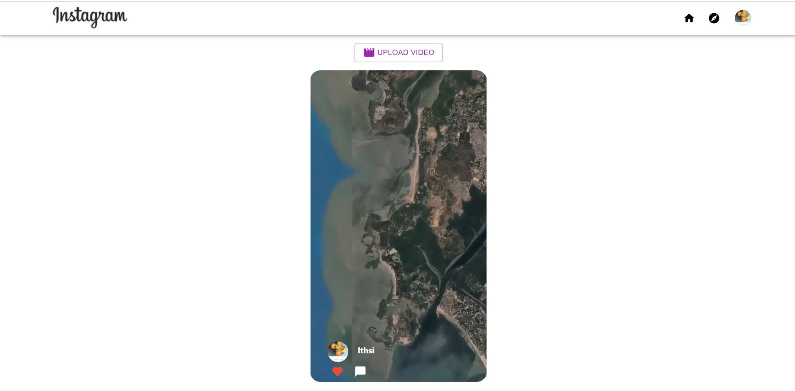
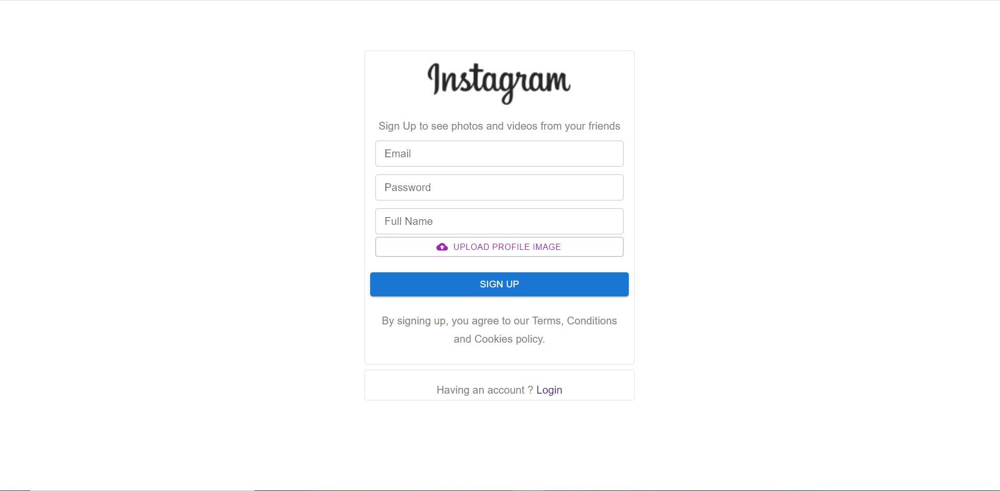
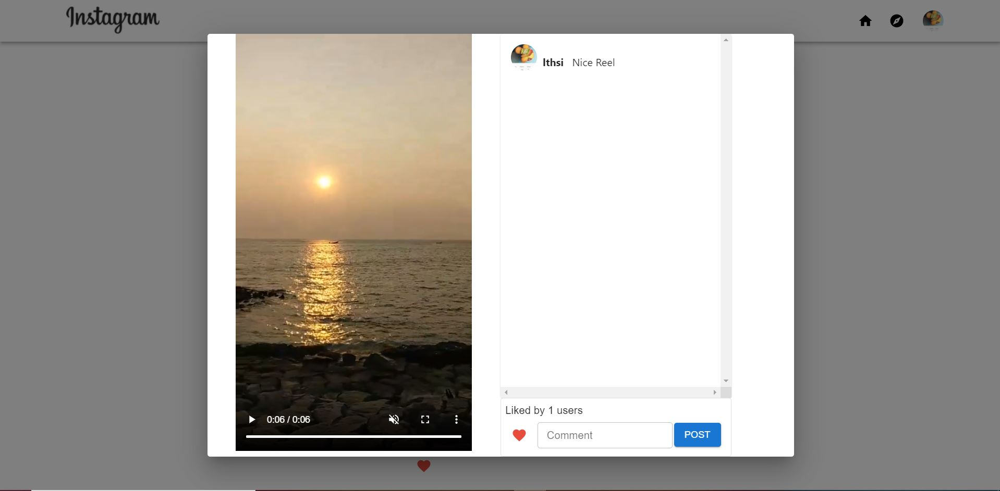
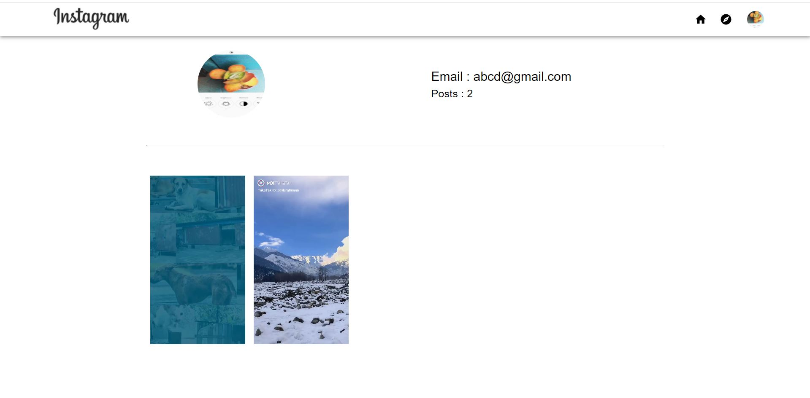

# Instagram Reels Clone

## Description
Building Instagram Reels Clone with help of Reactjs, Firebase and Material UI. User can login and sign up into their accounts and upload their reels videos and make likes and comments on it.

## Features
- SignUp/SignIn
- Upload Reels
- Likes
- Comments
- Autoscroll and AutoPlay of videos
- Profile Page
- Navigation Bar

## Screenshots

## Technologies Stack:

### Components
- Reactjs
- Firebase - Authentiaction
- Firebase - Database
- Firebase - Storage
- Hooks
- css
- Material UI
- React Router
- Observer API

### Insights
- used Reactjs and Material UI for designing Pages.
- React Router for Routing of Pages.
- Firebase Database is used to store Videos and user information.
- 3 schemas (User, likes, comments) are present.
- Automatic Scroll and Play on Videos
- Observer API is used for Autoplaying videos.

# Getting Started with Create React App

This project was bootstrapped with [Create React App](https://github.com/facebook/create-react-app).

### How to install
- Clone the Project in your local machine
- Navigate into the folder by terminal
- npm start

### `npm start`

Runs the app in the development mode.\
Open [http://localhost:3000](http://localhost:3000) to view it in the browser.

The page will reload if you make edits.\
You will also see any lint errors in the console.

